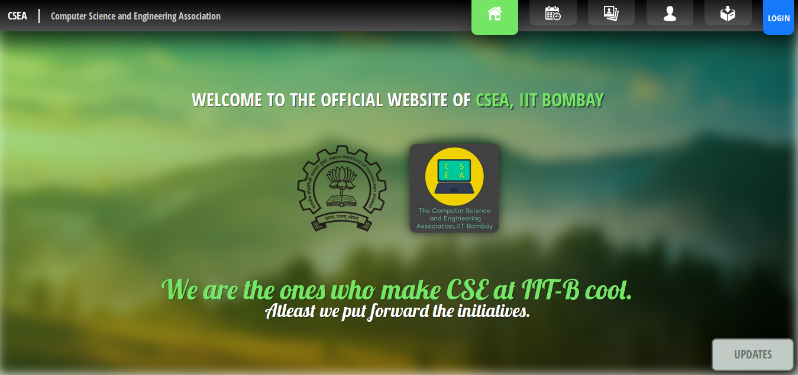

# CSEA Website 2017
This is the source code for the desktop version of the new website for Computer Science and Engineering Association (CSEA), IIT Bombay, developed during my tenure as the Web Secretary, CSEA. 

 In order to view the website offline, keep the directory structure intact and open the `index.html` webpage in a browser. Other pages can be navigated to from this page.  For best results, view on PC.
  
<strong>The static website is hosted on Github Pages. <a href="https://ys1998.github.io/CSEA-Website-2017/index.html">Click here to try it.</a> To visit the dynamic, updated website <a href="https://www.cse.iitb.ac.in/~csea/csea_2017/index.html">click here</a>.</strong>  Credits to `HTML5 UP` team for the template. <h5>Although I altered it too much!</h5>

